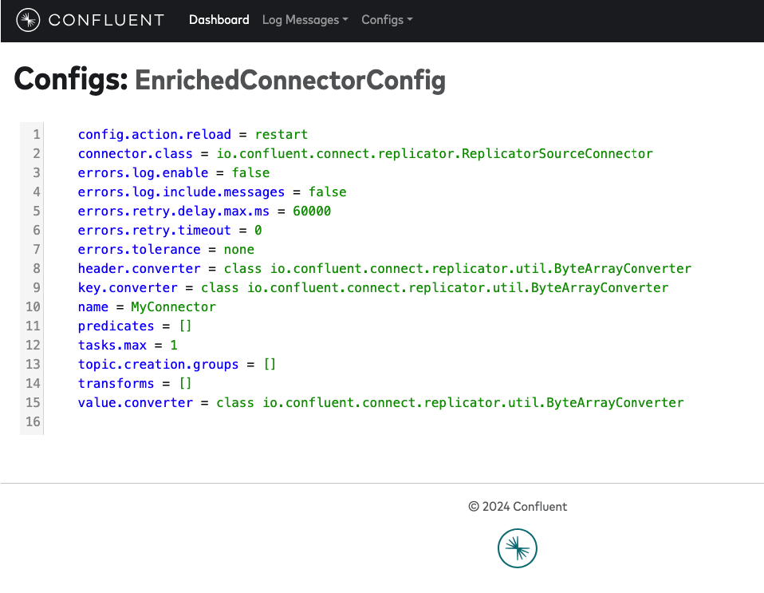

# Confluent Replicator Tools

An application and tool to help you work through large Replicator logs, designed to run through large `connect-distributed.log` files in an attempt to summarise what is going on with all the messages, configuration items and arrays that Replicator maintains (and emits log messages around).

## Getting Started

Start by running the main class `InspectLog`:

```bash
gradle run
```

If you're debugging an issue and want to review the logs, you can use `less -fr`:

```bash
rm output.txt && gradle run > output.txt && less -fr output.txt
```

Output from after the process has run:

```log
[2024-02-22 22:23:13,682] [INFO] Total Consumer messages: 1355
[2024-02-22 22:23:13,684] [INFO] Total Producer messages: 68
[2024-02-22 22:23:13,684] [INFO] Total WorkerTask messages: 474326
[2024-02-22 22:23:13,684] [INFO] Total WARN level messages: 57
[2024-02-22 22:23:13,684] [INFO] Total Assignment messages: 6
[2024-02-22 22:23:13,684] [INFO] Total Unclassified messages: 23343
```

A Web UI is also available on port 9992 by defaut:

